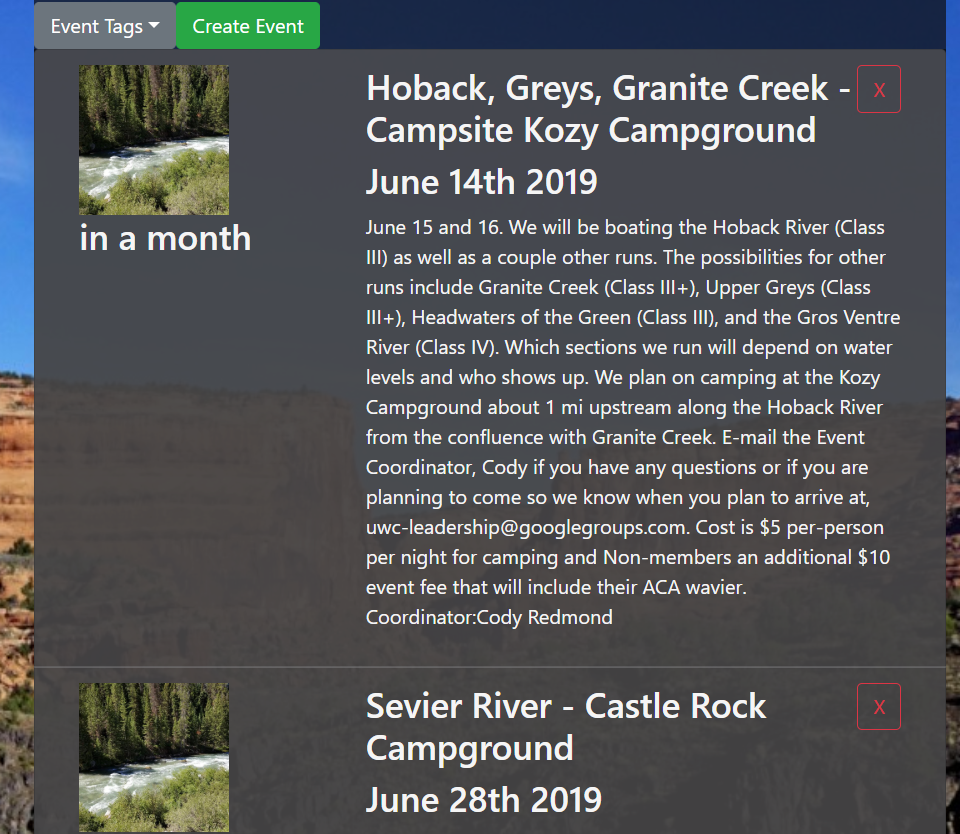

# Northern Utah Boater Alliance (NUBA) #

**[Deployed Heroku Link](https://enigmatic-wave-85254.herokuapp.com/)**

Landing page for the whitewater boating community of Northern Utah

## Table of contents
* [General info](#general-info)
* [Technologies](#technologies)
* [Setup](#setup)
* [Screenshots](#screenshots)

# General info #

- Utilizing the USGS Water Services API, this web app displays realtime river level data from rivers along Utah's Wasatch Front.
- Rivers have pre-set High, Medium, and Low levels determined by guidebooks, when the level comes in from the API the individual rivers are rendered a specific color based on those levels. Users can also click the gauge to get a 7-day chart of the rivers level.  
- Whitewater events calender utilizing MongoDB for CRUD, users can sort events by tags to see whats going on in the area, and also post their own events.
- Uses React Google Maps to display gauge components on regional map that shows current river levels and the 7-day charts

# Technologies #
Project is created with:
* `ReactJS` 
* `Axios` version 0.18.0
* `Express` version 4.16.3
* `Mongoose` version 5.3.16
* `NodeJS` version 8.12.0
* `MongoDB` version 8.12.0
* `google-map-react` version 1.1.4
* `react-moment` version 2.24.0
* `reactstrap` version 8.0.0
* `recharts` version 1.5.0

# Setup # 

1. Start by installing front and backend dependencies from package.json. While in top level, run the following command:
```
npm install
```
This should install node modules within the server and the client folder.

2. With Mongo running, run the following command in your terminal:
```
npm start
```
- Runs the app in the development mode.<br>
Open [http://localhost:3000](http://localhost:3000) to view it in the browser.

The page will reload if you make edits.<br>
You will also see any lint errors in the console.

# Screenshots #




